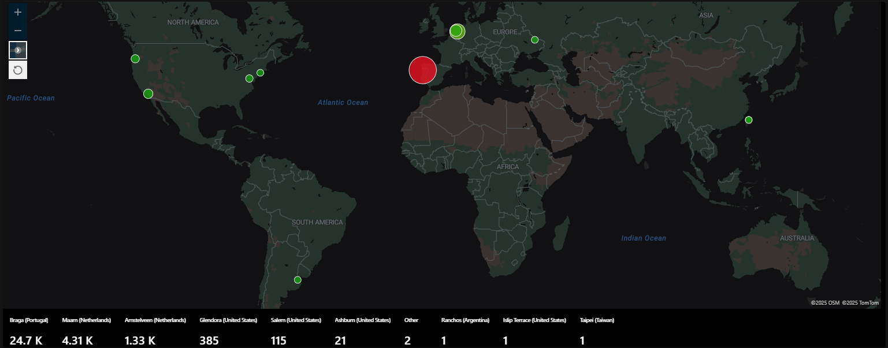

# Azure Sentinel Security Monitoring

## Overview
  Set up a cloud-based Security Information and Event Management (SIEM) solution using Microsoft Sentinel, ingest security logs from a Windows virtual machine, detect failed login attempts, and visualize attack data on a global map.

## Tools Used
  - Microsoft Sentinel
  - Log Analytics Workspace
  - Azure Virtual Machine (Windows)
  - KQL (Kusto Query Language)
  - Microsoft Defender for Cloud

## Resource Group Infrastructure
  
  
## Key Features
  - Detecting failed login attempts using KQL queries.
  - Identified attacker IPs.
  - Visualized attack data on a global map through IP locations in Microsoft Sentinel.
### KQL Query Showcasing IP Address Attacks Per IP Adress
  

  ## Attack Map Visualization
  ### This is the final mapping of IP Adresses tied to geolocation

